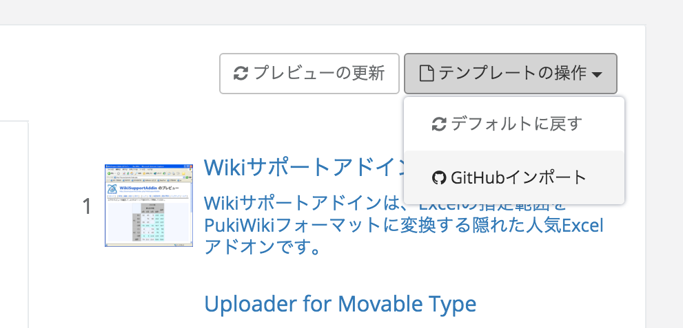
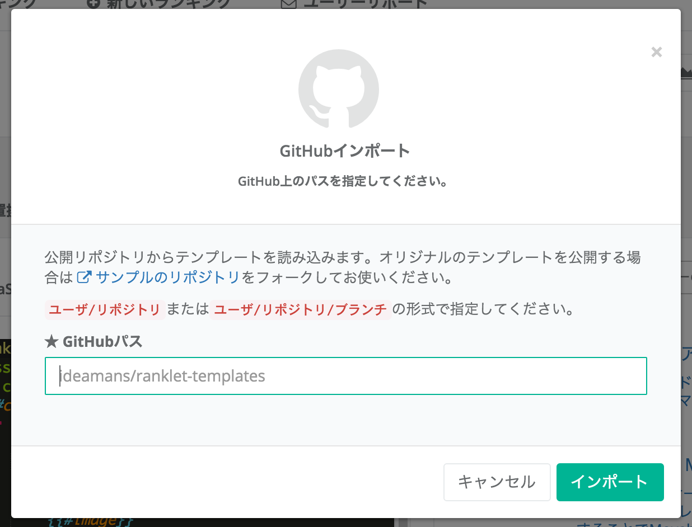
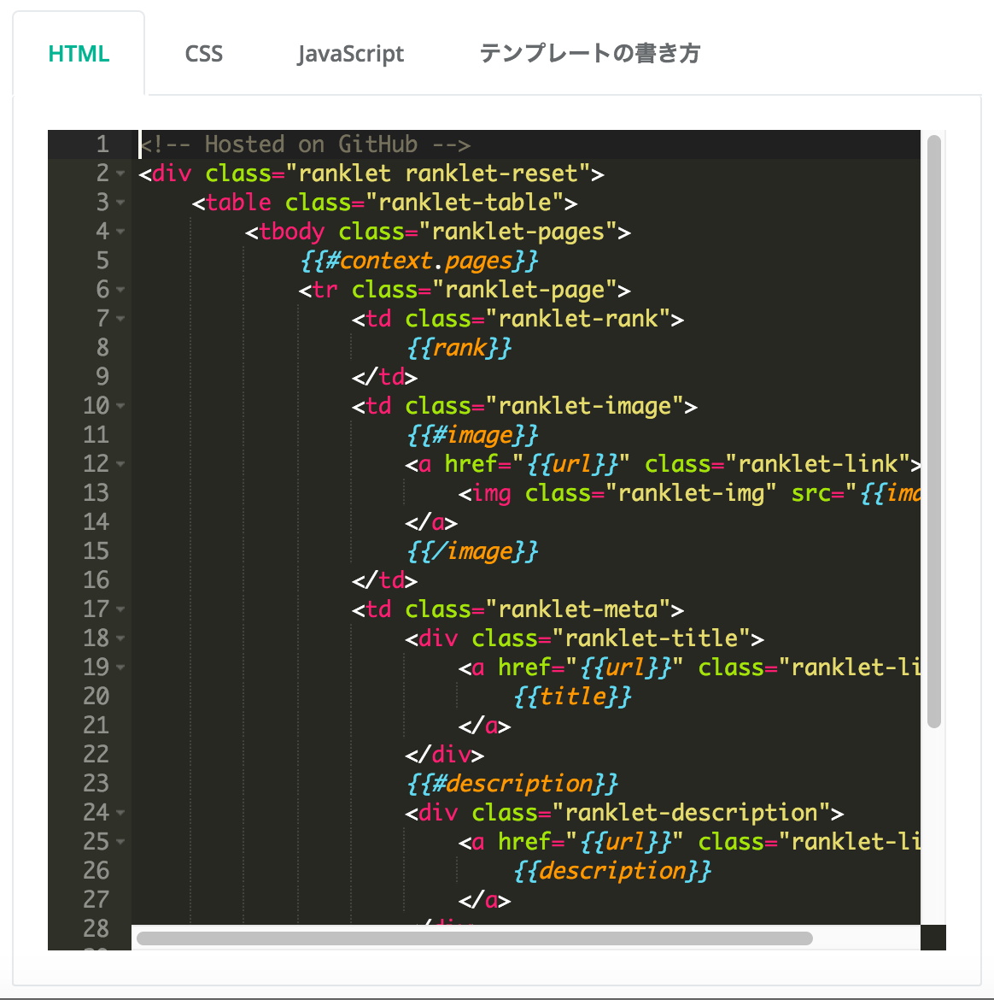

# このリポジトリは

Ranklet [ランクレット] ( https://ranklet.com )用のテンプレートセットです。

テンプレート編集画面でGithub上のパス ( 例: ideamans/ranklet-templates ) を指定することで簡単にインポートすることができます。

このリポジトリをフォークして、カスタムテンプレートの制作・配布にお役立てください。

# テンプレートのインポート方法

テンプレートの編集タブで、 `テンプレートの操作` &gt; `GitHubインポート` を選択します。

ダイアログにGitHubのパス(https://github.com/ 以降のパス)を指定し、インポートボタンを押します。

エディタにGitHub上からインポートされたテンプレートが反映されます。テンプレートを適用するには忘れずに保存を行ってください。

# ファイル構成

Ranklet [ランクレット] のテンプレートと同様にMustacheを利用できます。

* ranking.html HTMLテンプレート
* ranking.scss SCSSテンプレート
* ranking.js JavaScriptテンプレート
* README.md このファイル
* config.yml 設定ファイル(未使用/拡張性のため確保)
